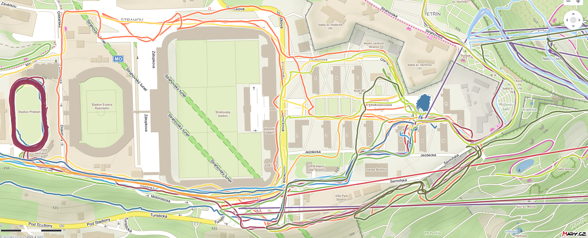
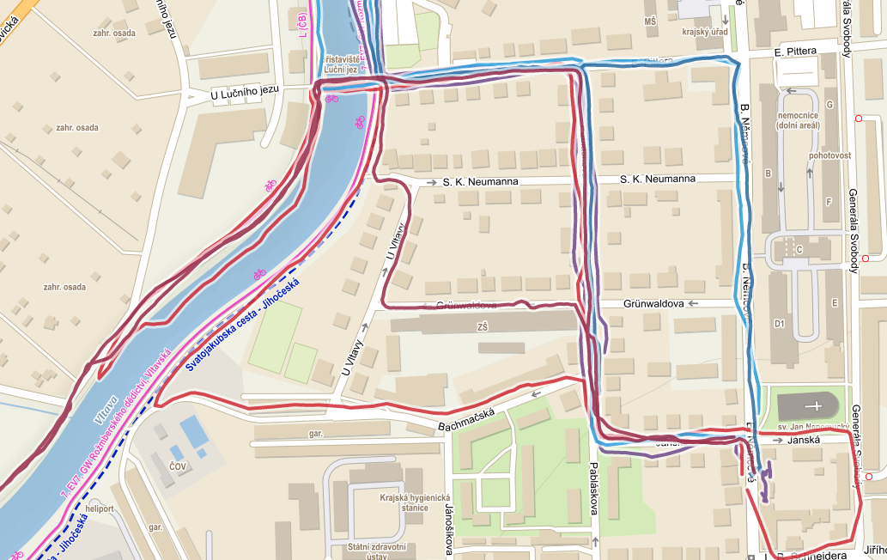
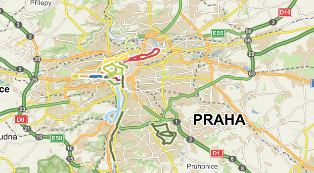

# DrawMyRun

Prerequisites: `java17`, `maven`.
Warning - maven is annoying. Download it, unzip it and **add the
path to maven/bin to your `PATH` variable**. It is all [here](https://maven.apache.org/install.html).

In the source code, in the App.java, you have to add your client_id
and client_secret (generated by Strava - you have to add an application).

Compile the app with `mvn compile` and to run it, run `mvn exec:java -Dexec.mainClass="App" -Dexec.args="web.html Run"`.

You will have to authorize with your Strava account.

Follow the instructions in the program :)

